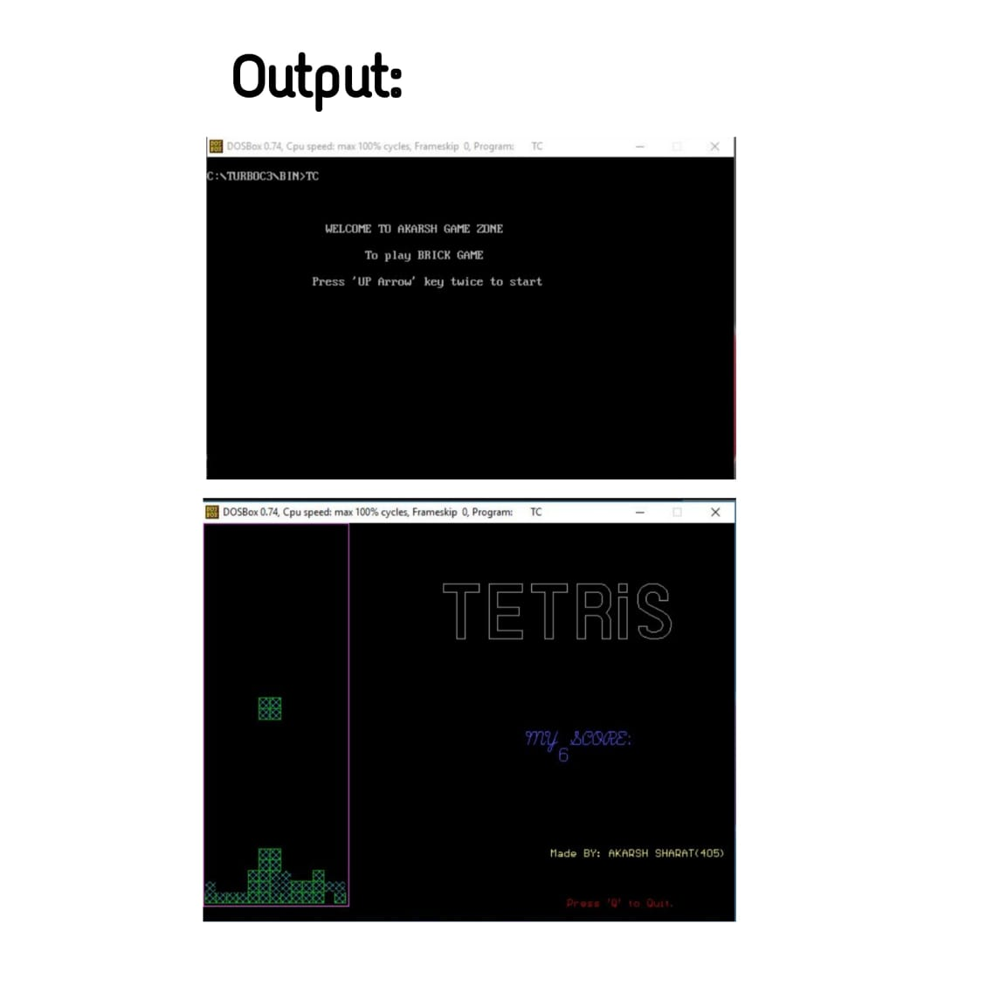

# Tetris Game
# Description:
We were asked by our collage proff to create a C-Language based program. So, I thought of make someting which is fun to code and also entertaining.
So I created a game which we use to play as a kid "Tetris"
# Different Libraries Used:
1. stdio.h
2. stdlib.h
3. graphics.h
4. time.h
# How To Use:
1. If you are useing Dev C++ then you just have to copy the code and paste in your compiler and Run it.
2. But if you use Turbo C++ then copy this code and paste it in notepad and save_as 'tatic.c'then copy tatic.c file.

    Go to This PC-> programs -> TURBO -> WinRoot -> TURBO ->BIN  and then paste tatic.c file in BIN folder. 
After this you can open this file in Turbo C++ by clicking on open file
# Possible Reasons for Error:
1. graphic.h file might be missing from your computer.
2. time.h file might be missing

# Sample Output:

